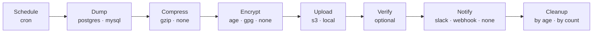

# dumptruckd

A modular database backup daemon written in Go. Handles periodic dumps, compression, encryption, upload, verification, notifications, and retention cleanup.

## How it works



Every stage is an interface. Add a new database, compressor, or upload target by implementing the interface and registering it in the factory — no existing code changes needed.

## Supported backends

| Stage | Backends |
|-------|----------|
| Database | PostgreSQL, MySQL |
| Compression | gzip, none (passthrough) |
| Encryption | age, GPG, none |
| Upload | S3 (and S3-compatible: R2, B2, MinIO), local filesystem |
| Notification | Slack, webhook, none |

## Install

```bash
# Homebrew
brew tap Saadlulu/tap
brew install dumptruckd

# APT (Debian/Ubuntu)
curl -fsSL https://saadlulu.github.io/dumptruckd/setup.sh | sudo bash
sudo apt-get install dumptruckd

# From source
git clone https://github.com/Saadlulu/dumptruckd
cd dumptruckd
make build

# Docker
docker pull ghcr.io/saadlulu/dumptruckd:latest
```

## Quick start

### Option 1: TOML config file

```bash
cp config/example-single-file.toml config/dumptruckd.toml
# Edit with your settings

export DB_PASSWORD="your-db-password"
export AWS_ACCESS_KEY_ID="your-key"
export AWS_SECRET_ACCESS_KEY="your-secret"

dumptruckd -config config/dumptruckd.toml
```

### Option 2: Environment variables only (no config file)

Set `DUMPTRUCKD_DB_TYPE` and dumptruckd builds a single backup job from env vars. This is the recommended mode for Docker and Kamal deployments.

```bash
export DUMPTRUCKD_DB_TYPE=postgres
export DUMPTRUCKD_DB_HOST=localhost
export DUMPTRUCKD_DB_NAME=myapp_production
export DUMPTRUCKD_DB_USER=backup_user
export DUMPTRUCKD_UPLOAD_TYPE=s3
export DUMPTRUCKD_S3_BUCKET=my-backups
export DUMPTRUCKD_S3_REGION=us-east-1
export DB_PASSWORD=your-db-password
export AWS_ACCESS_KEY_ID=your-key
export AWS_SECRET_ACCESS_KEY=your-secret

dumptruckd
```

Defaults: schedule `0 */6 * * *` (every 6 hours), compression `gzip`, backup name = database name.

## CLI flags

```
dumptruckd -config <path>       Run as daemon with TOML config
dumptruckd                      Run as daemon with env-var config (or auto-discover config file)
dumptruckd -once                Run all backups once and exit (no scheduler)
dumptruckd -run-now             Run all backups immediately and exit
dumptruckd -dry-run             Validate config, test adapters, check S3 access, send test notification
dumptruckd -test                Run built-in config tests (DB connection, upload round-trip, etc.)
dumptruckd -dump-config         Print the final resolved config as TOML and exit
dumptruckd -version             Print version and exit
dumptruckd restore --backup <name> --latest          Restore most recent backup
dumptruckd restore --backup <name> --timestamp <ts>  Restore specific backup
dumptruckd status                                    Show daemon status, backup history, and disk usage
dumptruckd status --json                             Same as above, machine-readable JSON output
```

`--once` is designed for single-shot container execution. No scheduler, no watchdog, no health server. Exit 0 on success, exit 1 on failure.

`--dry-run` validates config, creates all adapters, runs S3 HeadBucket, sends a test notification, and prints the next 3 scheduled run times per backup.

`--dump-config` loads, merges, and resolves all config (includes, config.d/, references, defaults) then prints the final result as TOML. Useful for debugging config at 2am.

## Kamal deployment

dumptruckd works as a Kamal accessory with zero config files. Full guide: [docs/DOCKER-KAMAL.md](docs/DOCKER-KAMAL.md)

Minimal `deploy.yml` snippet:

```yaml
# Top-level network -- applies to all accessories automatically.
# Do NOT also set options: network: on individual accessories.
network: myapp-private

accessories:
  db:
    image: postgres:17-alpine
    host: 1.2.3.4
    env:
      clear:
        POSTGRES_DB: myapp_production
        POSTGRES_USER: myapp
      secret:
        - POSTGRES_PASSWORD
    directories:
      - data:/var/lib/postgresql/data

  dumptruckd:
    image: ghcr.io/saadlulu/dumptruckd:latest
    host: 1.2.3.4
    env:
      clear:
        DUMPTRUCKD_DB_TYPE: postgres
        DUMPTRUCKD_DB_HOST: myapp-db
        DUMPTRUCKD_DB_PORT: "5432"
        DUMPTRUCKD_DB_NAME: myapp_production
        DUMPTRUCKD_DB_USER: myapp
        DUMPTRUCKD_UPLOAD_TYPE: s3
        DUMPTRUCKD_S3_BUCKET: myapp-backups
        DUMPTRUCKD_S3_REGION: us-east-1
        DUMPTRUCKD_SCHEDULE: "0 */6 * * *"
        DUMPTRUCKD_RETENTION_DAYS: "30"
        DUMPTRUCKD_RETENTION_KEEP_LAST: "10"
        DUMPTRUCKD_HEALTH_ENABLED: "true"
        DUMPTRUCKD_HEALTH_PORT: "8080"
      secret:
        - DB_PASSWORD
        - AWS_ACCESS_KEY_ID
        - AWS_SECRET_ACCESS_KEY
```

Both containers must share a Docker network. The top-level `network:` key handles this -- do not also set `options: network:` on individual accessories or Docker will error with "network specified multiple times". Kamal names the db container `myapp-db`, so `DUMPTRUCKD_DB_HOST: myapp-db` resolves via Docker DNS.

On-demand backup from Kamal:

```bash
kamal accessory exec dumptruckd --cmd "dumptruckd --once"
```

Check status from Kamal:

```bash
kamal accessory exec dumptruckd --cmd "dumptruckd status"
```

Restore from Kamal:

```bash
kamal accessory exec dumptruckd --cmd "dumptruckd restore --backup myapp_production --latest"
```

## Docker (standalone)

```bash
# As a daemon with config file
docker run -d \
  --name dumptruckd \
  --restart unless-stopped \
  -v /etc/dumptruckd:/app/config \
  --env-file /etc/dumptruckd/.env \
  ghcr.io/saadlulu/dumptruckd:latest \
  -config /app/config/dumptruckd.toml

# As a daemon with env vars only
docker run -d \
  --name dumptruckd \
  --restart unless-stopped \
  -e DUMPTRUCKD_DB_TYPE=postgres \
  -e DUMPTRUCKD_DB_HOST=db \
  -e DUMPTRUCKD_DB_NAME=myapp \
  -e DUMPTRUCKD_DB_USER=backup \
  -e DUMPTRUCKD_UPLOAD_TYPE=local \
  -e DUMPTRUCKD_UPLOAD_PATH=/var/backups \
  -e DB_PASSWORD=secret \
  -v /var/backups:/var/backups \
  ghcr.io/saadlulu/dumptruckd:latest

# One-shot backup (e.g., from cron or CI)
docker run --rm \
  --env-file /etc/dumptruckd/.env \
  ghcr.io/saadlulu/dumptruckd:latest \
  --once
```

## Features

### Encryption

Encrypt backups before upload using age or GPG:

```bash
# TOML
[backup.encrypt]
type = "age"

# Env vars
export DUMPTRUCKD_ENCRYPT_TYPE=age
export DUMPTRUCKD_AGE_RECIPIENT="age1xxxxxxxxxxxxxxxxxxxxxxxxxxxxxxxxxxxxxxxxx"
```

The `age` or `gpg` binary must be in PATH. Encrypted files get `.age` or `.gpg` appended. The unencrypted file is removed after encryption.

### Backup verification

Download and validate the backup after upload:

```bash
# TOML
verify = true

# Env vars
export DUMPTRUCKD_VERIFY=true
```

Downloads the uploaded file, decompresses, and checks the format (PostgreSQL header validation). Verification failure sends a notification but does not mark the backup as failed -- the data is already uploaded.

### Size anomaly detection

Track backup sizes and alert on significant deviations:

```bash
# TOML
size_alert_threshold = 50  # percentage

# Env vars
export DUMPTRUCKD_SIZE_ALERT_THRESHOLD=50
```

Maintains a rolling window of the last 10 sizes per job. Alerts when deviation exceeds the threshold. Skips detection until 3 backups are recorded.

### Pre/post hooks

Run custom commands before and after each backup:

```bash
# TOML
[backup.hooks]
pre = "/usr/local/bin/pre-backup.sh"
post = "/usr/local/bin/post-backup.sh"

# Env vars
export DUMPTRUCKD_HOOK_PRE="/usr/local/bin/pre-backup.sh"
export DUMPTRUCKD_HOOK_POST="/usr/local/bin/post-backup.sh"
```

Hooks receive `DUMPTRUCKD_HOOK_BACKUP_NAME`, `DUMPTRUCKD_HOOK_STATUS`, and `DUMPTRUCKD_HOOK_FILE_PATH` as environment variables. Pre-hook failure aborts the backup. Post-hook failure logs a warning. 60-second timeout.

### Retention

Keep backups by age, count, or both:

```bash
# TOML
[backup.retention]
days = 30
keep_last = 10

# Env vars
export DUMPTRUCKD_RETENTION_DAYS=30
export DUMPTRUCKD_RETENTION_KEEP_LAST=10
```

Union policy: a file is kept if it satisfies either condition. Local filesystem only -- for S3, use lifecycle policies.

### Health and metrics

```bash
# TOML
[health]
enabled = true
port = 8080

# Env vars
export DUMPTRUCKD_HEALTH_ENABLED=true
export DUMPTRUCKD_HEALTH_PORT=8080
```

Endpoints:
- `GET /healthz` -- JSON with per-backup status (last run, success/failure counts, duration, size, consecutive failures). Status is `degraded` when any backup has 3+ consecutive failures.
- `GET /metrics` -- Prometheus format (`dumptruckd_up`, `dumptruckd_backup_runs_total`, `dumptruckd_backup_failures_total`).

Optional auth: set `HEALTH_BEARER_TOKEN` env var or `token` in config.

### Status command

Check daemon state, backup history, and disk usage from the command line:

```bash
dumptruckd status
```

```
┌────────────────────────────────────────────────────────────────┐
│  dumptruckd                                                    │
├─ Daemon ───────────────────────────────────────────────────────┤
│  Status         RUNNING                                        │
│  Uptime         5d 3h 22m                                      │
│  Since          2026-04-09 03:21:24                            │
│  Jobs           2 configured                                   │
├─ prod-postgres ────────────────────────────────────────────────┤
│  Database       myapp_production (postgres)                    │
│  Schedule       0 0 2 * * *                                    │
│  Upload         /var/backups/dumptruckd                        │
│  Retention      30 days + keep last 7                          │
│                                                                │
│  Health         OK                                             │
│  Last Success   2026-04-14 02:00:12 (2m34s)                    │
│  Last Size      768.0 KB                                       │
│  Runs           142 total, 1 failed                            │
│  Next Run       2026-04-15 02:00:00 (in 17h 59m)               │
│                                                                │
│  On Disk        3 files, 1.7 MB total                          │
│  Latest File    prod-postgres_20260414_020000.sql.gz           │
│  Latest Size    768.0 KB                                       │
│  Latest Date    2026-04-14 02:03:12                            │
└────────────────────────────────────────────────────────────────┘
```

Use `--json` for scripting and monitoring integrations:

```bash
dumptruckd status --json | jq '.backups[0].live.run_count'
```

The status command queries the health endpoint on localhost (requires `health.enabled = true`). For local uploads, it also scans the filesystem for backup file counts and sizes. When the daemon is not running, it still shows config info and whatever is on disk.

No sensitive data is exposed -- no hostnames, credentials, or connection details.

### S3-compatible storage

Use Cloudflare R2, Backblaze B2, MinIO, or any S3-compatible service:

```bash
export DUMPTRUCKD_S3_ENDPOINT=https://your-account.r2.cloudflarestorage.com
export DUMPTRUCKD_S3_REGION=auto
```

When a custom endpoint is set, path-style addressing is used and server-side encryption is skipped automatically.

### Structured logging

```toml
[logging]
level = "info"    # debug, info, warn, error
format = "text"   # text, json
output = "stdout" # stdout, stderr, or a file path
```

### Retry with backoff

Transient failures (network blips, temporary DB unavailability) are retried with exponential backoff and jitter. Default: 3 retries, 2-second base delay.

## Environment variable reference

### Config variables (env-var mode)

| Variable | Default | Required |
|----------|---------|----------|
| `DUMPTRUCKD_DB_TYPE` | -- | Yes |
| `DUMPTRUCKD_DB_HOST` | -- | Yes |
| `DUMPTRUCKD_DB_PORT` | 5432/3306 | No |
| `DUMPTRUCKD_DB_NAME` | -- | Yes |
| `DUMPTRUCKD_DB_USER` | -- | Yes |
| `DUMPTRUCKD_UPLOAD_TYPE` | -- | Yes |
| `DUMPTRUCKD_S3_BUCKET` | -- | When S3 |
| `DUMPTRUCKD_S3_REGION` | us-east-1 | No |
| `DUMPTRUCKD_S3_PREFIX` | -- | No |
| `DUMPTRUCKD_S3_ENDPOINT` | -- | No |
| `DUMPTRUCKD_UPLOAD_PATH` | /var/backups/dumptruckd | No |
| `DUMPTRUCKD_COMPRESS_TYPE` | gzip | No |
| `DUMPTRUCKD_SCHEDULE` | 0 */6 * * * | No |
| `DUMPTRUCKD_BACKUP_NAME` | DB_NAME value | No |
| `DUMPTRUCKD_NOTIFY_TYPE` | -- | No |
| `DUMPTRUCKD_RETENTION_DAYS` | -- | No |
| `DUMPTRUCKD_RETENTION_KEEP_LAST` | -- | No |
| `DUMPTRUCKD_ENCRYPT_TYPE` | -- | No |
| `DUMPTRUCKD_VERIFY` | false | No |
| `DUMPTRUCKD_SIZE_ALERT_THRESHOLD` | 50 | No |
| `DUMPTRUCKD_HOOK_PRE` | -- | No |
| `DUMPTRUCKD_HOOK_POST` | -- | No |
| `DUMPTRUCKD_LOG_LEVEL` | info | No |
| `DUMPTRUCKD_LOG_FORMAT` | text | No |
| `DUMPTRUCKD_HEALTH_ENABLED` | false | No |
| `DUMPTRUCKD_HEALTH_PORT` | 8080 | No |

### Credential variables (both modes)

| Variable | Used by |
|----------|---------|
| `DB_PASSWORD` | Database dump/restore (takes precedence) |
| `DB_PASSWORD_{DBNAME}` | Database dump/restore (fallback) |
| `AWS_ACCESS_KEY_ID` | S3 uploader |
| `AWS_SECRET_ACCESS_KEY` | S3 uploader |
| `SLACK_WEBHOOK_URL` | Slack notifier (fallback when not in config) |
| `HEALTH_BEARER_TOKEN` | Health endpoint auth |
| `DUMPTRUCKD_AGE_RECIPIENT` | age encryption |
| `DUMPTRUCKD_GPG_RECIPIENT` | GPG encryption |

## Project structure

```
dumptruckd/
├── cmd/dumptruckd/      # Entry point, CLI flags, graceful shutdown
├── pkg/
│   ├── config/          # TOML config loading, env-var config, validation
│   ├── scheduler/       # Cron scheduling, concurrency limits, graceful drain
│   ├── dump/            # Database dump adapters (Dumper interface)
│   ├── compress/        # Compression adapters (Compressor interface)
│   ├── encrypt/         # Encryption adapters (Encryptor interface)
│   ├── upload/          # Upload adapters (Uploader interface)
│   ├── verify/          # Post-upload backup verification
│   ├── notify/          # Notification adapters (Notifier interface)
│   ├── retention/       # Local filesystem retention cleanup
│   ├── health/          # Health check and Prometheus metrics server
│   ├── hooks/           # Pre/post backup hook execution
│   ├── sizetrack/       # Backup size tracking and anomaly detection
│   ├── watchdog/        # Stale backup detection and alerting
│   ├── restore/         # Backup restore pipeline
│   └── test/            # Built-in configuration test framework
├── internal/
│   ├── credentials/     # Secure credential retrieval from env vars
│   ├── fileops/         # Shared file operations (decrypt, decompress)
│   ├── logger/          # Structured logging (log/slog) setup
│   ├── retry/           # Exponential backoff with jitter
│   └── utils/           # Path sanitization and timestamp utilities
├── config/              # Configuration templates and examples
├── docs/                # Deployment, configuration, Docker/Kamal guides
└── examples/            # Systemd service file
```

## Documentation

- [Configuration Guide](docs/CONFIGURATION.md) -- TOML config, env vars, all options
- [Docker and Kamal Guide](docs/DOCKER-KAMAL.md) -- Complete Kamal accessory setup
- [Deployment Guide](docs/DEPLOYMENT.md) -- Systemd, Docker, security checklist
- [Testing Guide](docs/TESTING.md) -- Built-in config tester
- [Building](docs/BUILDING.md) -- Build from source

## Development

```bash
go test ./...          # Run tests
go test -cover ./...   # With coverage
go vet ./...           # Catch common mistakes
gofmt -w .             # Format code
go mod tidy            # Sync dependencies
make build             # Build binary
```

## Security

All credentials come from environment variables. No secrets in config files. Database dump commands run with minimal environments (only PATH, HOME, and credential files). Backup files are written with 0600 permissions. Upload paths are sanitized against directory traversal. Webhook URLs require HTTPS (Slack) or explicit opt-in for HTTP.

## License

MIT
